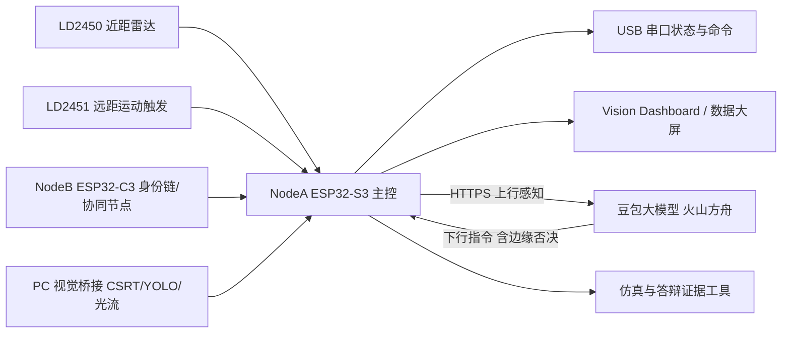

# Flytotal

Flytotal 是一个面向低空治理/无人机监测演示的 ESP32 边缘节点项目。当前主线是 v5.2：NodeA 使用 ESP32-S3 作为主控，接入 LD2450 近距毫米波雷达、LD2451 远距运动触发、视觉桥接、NodeB 身份链/协同节点，对接火山方舟豆包大模型做云端威胁研判与下行指令（含边缘安全否决），并把结果输出到串口和网页大屏。

## 当前定位

- 100m 只承诺远距运动预警触发，不承诺稳定识别小型无人机。
- LD2451 不是无人机专用雷达，本项目把它作为低成本远距运动触发源。
- 视觉用于目标确认和证据固化，弱光、雾天、遮挡时由雷达主导。
- ESP32-S3 负责边缘采集、状态融合、串口输出和协同节点接入，复杂视觉算法仍在 PC/云端侧运行。
- NodeB 先作为身份链和协同感知节点，主链 handoff 四态机保留到后续版本。

## 系统架构



## 四个答辩创新点

1. 端边云协同的大模型威胁研判：NodeA 事件触发时 HTTPS 上行多源感知数据到豆包大模型，云端返回威胁等级、告警和下行指令；边缘端保留安全否决权，形成“云端智能 + 边缘安全冗余”的闭环。
2. 复杂环境下的多模态融合感知：LD2450、LD2451、RID/NodeB、视觉置信度按 FAR/MID/NEAR 分阶段融合。
3. 抗干扰与非无人机过滤：多旋翼特征筛选使用速度区间、持续时长、悬停稳定性、航向变化率。
4. ESP32 边缘节点与多节点协同：NodeA/NodeB 串口联调、在线状态、掉线检测、协同大屏和后续 handoff 扩展。

## 快速编译

```powershell
pio run
pio run -d examples\nodeb_c3_identity_uart
```

如果 PowerShell 找不到 `pio`，先运行：

```powershell
$env:Path += ";$env:USERPROFILE\.platformio\penv\Scripts"
```

## 最短 Demo 路线

1. NodeA 单板：烧录主固件后执行 `CONFIG,STATUS`、`FUSION,STATUS`、`FUSION,ENABLE,1/0`。
2. NodeA + NodeB：C3 的 `GPIO4 TX -> S3 GPIO15 RX`，共 GND，验证 `nodeb_online=1` 和拔线后掉线告警。
3. LD2451：先执行 `LD2451,SELFTEST`，再用文本仿真 `LD2451,range_m=50,speed_mps=1.2,approach=1,valid=1`，最后接真实模块。
4. 视觉大屏：启动 `vision_web_server_视觉网页服务.py` 和 NodeA 串口桥接，验证红绿双框、视觉置信度和协同视图。
5. 证据输出：运行 fusion/gimbal/multirotor/co-sensing 仿真工具，保存 `outputs/` 下的 PNG/JSON。

## 关键串口命令

```text
CONFIG,STATUS
FUSION,STATUS
FUSION,ENABLE,1
FUSION,ENABLE,0
FUSION,DEBUG
VISION,CONF,confidence=0.82,stability=0.91,state=TRACKING
LD2451,SELFTEST
LD2451,range_m=50,speed_mps=1.2,approach=1,valid=1
LD2451,CLEAR
CLOUD,STATUS
CLOUD,TEST
CLOUD,APPLY,ADJUST_THRESHOLD,70
CLOUD,APPLY,SWITCH_MODE,ECONOMY
CLOUD,RESET
```

## 推荐阅读

- [v5.2 总纲](docs/2026-05-08_v5_2_overall_upgrade_v1.md)
- [硬件 BOM 与接线](docs/2026-05-08_hardware_bom_wiring_v1.md)
- [算法公式书](docs/2026-05-08_algorithm_formula_book_v1.md)
- [v5.2 回退与现场 Runbook](docs/2026-05-08_v5_2_runbook_v1.md)
- [v5.2 变更记录](docs/CHANGELOG_v5.2.md)

## 给小白的解释

这个项目不是让 ESP32 自己完成所有复杂识别，而是让 ESP32 做“边缘节点”：它负责接雷达、接协同节点、接视觉结果、输出状态和大屏证据。远处先预警，近处再确认，答辩时一定要把这个边界说清楚。
