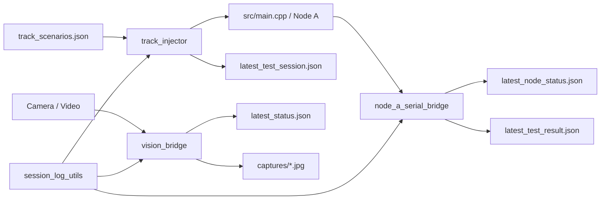

# 工具链逻辑总图

日期：`2026-04-06`

## 如果你当前重点是“看懂这一阶段固件主链”

这份文档名字虽然叫“工具链逻辑总图”，但你当前阶段真正最需要先看懂的，不只是 Python 工具，而是：

- 固件主链现在已经能做什么
- 当前风险、事件、云台、串口命令是怎么串起来的
- 哪些图最适合 0 基础先建立整体理解

所以如果你当前重点是“看懂这一阶段代码功能和参数”，建议先按下面顺序读：

1. [flytotal-beginner-logic-map（小白版总逻辑图）.html](C:/Users/WZwai/Documents/PlatformIO/Projects/Flytotal/diagrams/flytotal-beginner-logic-map（小白版总逻辑图）.html)
   先建立“整条链由谁负责”的整体印象。
2. [flytotal-parameter-glossary（参数词典）.html](C:/Users/WZwai/Documents/PlatformIO/Projects/Flytotal/diagrams/flytotal-parameter-glossary（参数词典）.html)
   先搞懂常见参数和它们控制什么。
3. [main-host-command-map（主机命令影响图）.html](C:/Users/WZwai/Documents/PlatformIO/Projects/Flytotal/diagrams/main-host-command-map（主机命令影响图）.html)
   搞懂 `TRACK / RID / STATUS / RESET` 这些命令进入设备后会影响哪里。
4. [2026-04-02_node_a_full_logic_map（NodeA全功能逻辑图）.md](C:/Users/WZwai/Documents/PlatformIO/Projects/Flytotal/docs/2026-04-02_node_a_full_logic_map（NodeA全功能逻辑图）.md)
   再看完整的模块关系、状态机和输出链。
5. [2026-04-02_window_handoff_summary（窗口交接总结）.md](C:/Users/WZwai/Documents/PlatformIO/Projects/Flytotal/docs/2026-04-02_window_handoff_summary（窗口交接总结）.md)
   最后看当前阶段结论、参数解释、已完成项和下一阶段重点。

## 建议先看这个顺序

如果你现在最想解决的是“我完全看不懂这些脚本之间怎么配合”，建议按下面顺序打开：

1. 小白版总图  
   [flytotal-beginner-logic-map（小白版总逻辑图）.html](C:/Users/WZwai/Documents/PlatformIO/Projects/Flytotal/diagrams/flytotal-beginner-logic-map（小白版总逻辑图）.html)
2. 参数词典  
   [flytotal-parameter-glossary（参数词典）.html](C:/Users/WZwai/Documents/PlatformIO/Projects/Flytotal/diagrams/flytotal-parameter-glossary（参数词典）.html)
3. `main.cpp` 主机命令影响图  
   [main-host-command-map（主机命令影响图）.html](C:/Users/WZwai/Documents/PlatformIO/Projects/Flytotal/diagrams/main-host-command-map（主机命令影响图）.html)
4. `main.cpp` 小白版工人分工图  
   [main-cpp-beginner-diagram（小白版工人分工图）.html](C:/Users/WZwai/Documents/PlatformIO/Projects/Flytotal/diagrams/main-cpp-beginner-diagram（小白版工人分工图）.html)
5. 工程总图  
   [flytotal-tool-chain-diagram（工具链总工程图）.html](C:/Users/WZwai/Documents/PlatformIO/Projects/Flytotal/diagrams/flytotal-tool-chain-diagram（工具链总工程图）.html)

## 已有详细图入口

- `main.cpp` 详细图：[main-cpp-detailed-diagram（详细功能逻辑图）.html](C:/Users/WZwai/Documents/PlatformIO/Projects/Flytotal/diagrams/main-cpp-detailed-diagram（详细功能逻辑图）.html)
- `track_injector` 详细图：[track-injector-detailed-diagram（轨迹注入器详细图）.html](C:/Users/WZwai/Documents/PlatformIO/Projects/Flytotal/diagrams/track-injector-detailed-diagram（轨迹注入器详细图）.html)
- `node_a_serial_bridge` 详细图：[node-a-serial-bridge-detailed-diagram（串口桥接详细图）.html](C:/Users/WZwai/Documents/PlatformIO/Projects/Flytotal/diagrams/node-a-serial-bridge-detailed-diagram（串口桥接详细图）.html)
- `vision_bridge` 详细图：[vision-bridge-detailed-diagram（视觉桥接详细图）.html](C:/Users/WZwai/Documents/PlatformIO/Projects/Flytotal/diagrams/vision-bridge-detailed-diagram（视觉桥接详细图）.html)

## 这次新增的 3 张“小白友好”图是干什么的

- [flytotal-beginner-logic-map（小白版总逻辑图）.html](C:/Users/WZwai/Documents/PlatformIO/Projects/Flytotal/diagrams/flytotal-beginner-logic-map（小白版总逻辑图）.html)  
  用“5 个角色 + 一轮测试怎么走”的方式讲整体，不要求你先懂串口、tracker、session。

- [flytotal-parameter-glossary（参数词典）.html](C:/Users/WZwai/Documents/PlatformIO/Projects/Flytotal/diagrams/flytotal-parameter-glossary（参数词典）.html)  
  单独解释参数和名词，告诉你 `interval`、`hold-repeat`、`status-interval`、`tracker`、`session` 到底是什么意思。

- [main-host-command-map（主机命令影响图）.html](C:/Users/WZwai/Documents/PlatformIO/Projects/Flytotal/diagrams/main-host-command-map（主机命令影响图）.html)  
  专门讲 `TRACK`、`RID`、`STATUS`、`SELFTEST`、`SUMMARY`、`KP`、`KD`、`RESET` 进入 `main.cpp` 后会影响什么。

- [main-cpp-beginner-diagram（小白版工人分工图）.html](C:/Users/WZwai/Documents/PlatformIO/Projects/Flytotal/diagrams/main-cpp-beginner-diagram（小白版工人分工图）.html)  
  把 `RadarTask / TrackingTask / CloudTask` 画成“3 个工人分工图”，先讲人话职责，再讲它们怎么接力。

## 你最容易卡住的几个点

- `track_injector` 不是判结果的，它只是“喂测试输入”的。
- `main.cpp` 才是设备端真正做判断的地方。
- `node_a_serial_bridge` 不是控制器，它更像“翻译员 + 记录员”。
- `vision_bridge` 不是检测模型，它更像“人工选框后的跟踪和抓拍器”。

## 关系速览

