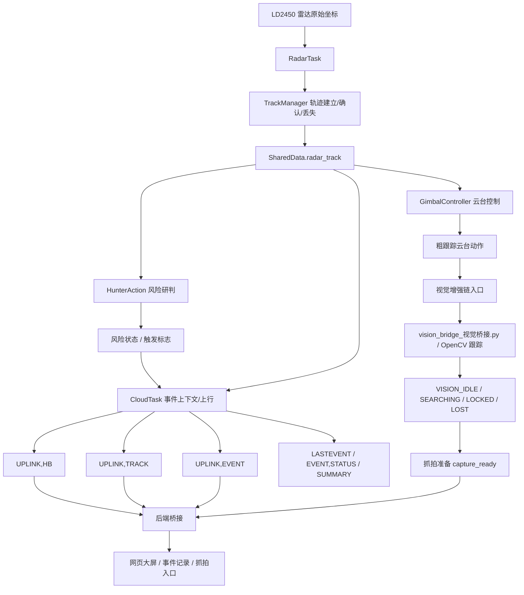
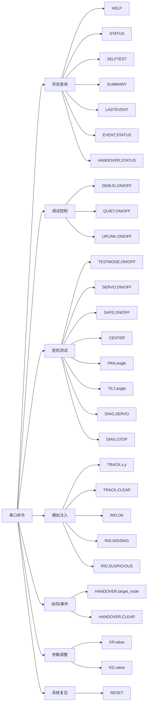
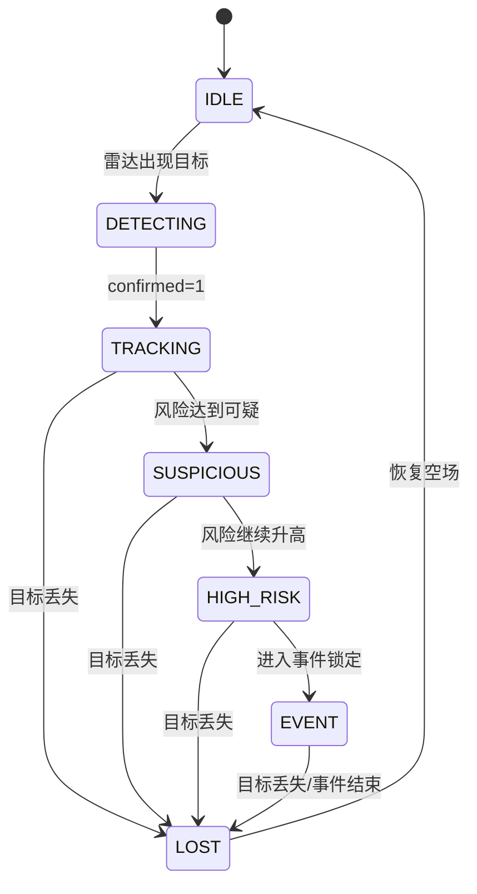
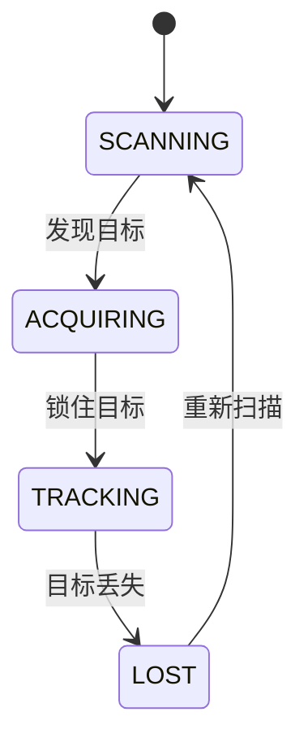
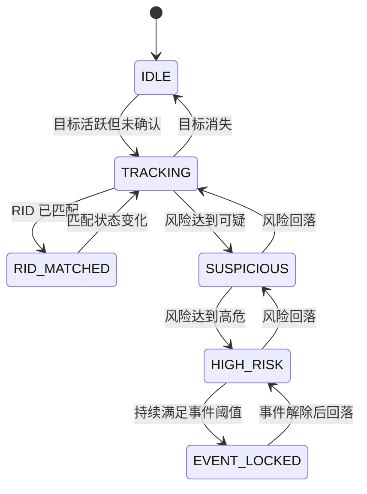
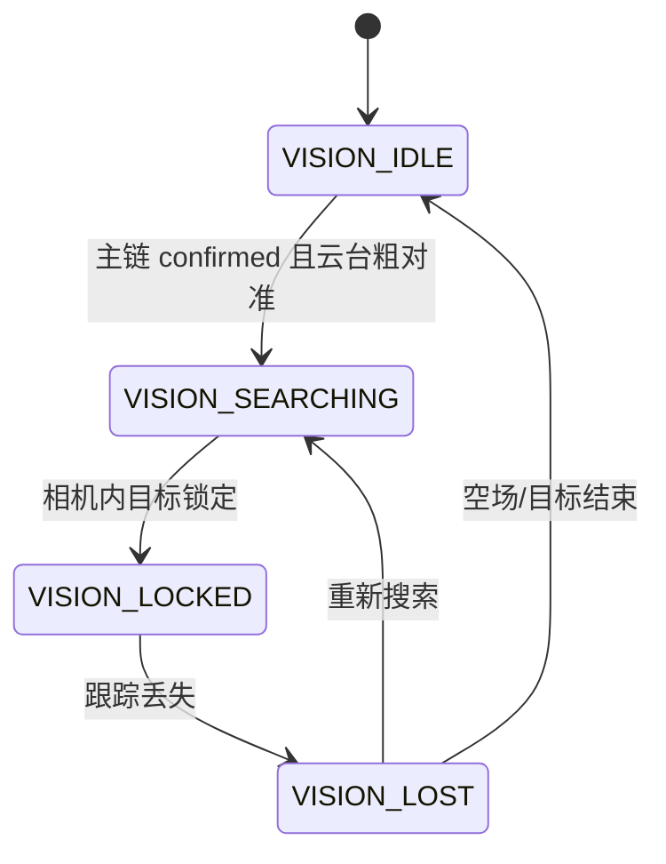
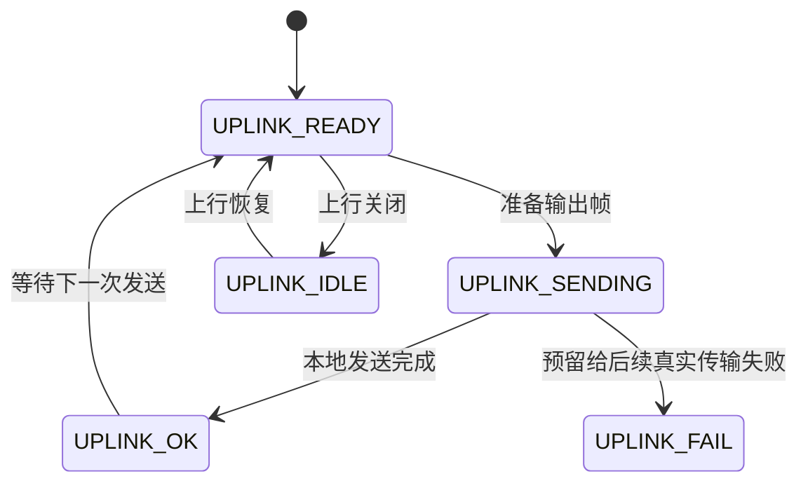
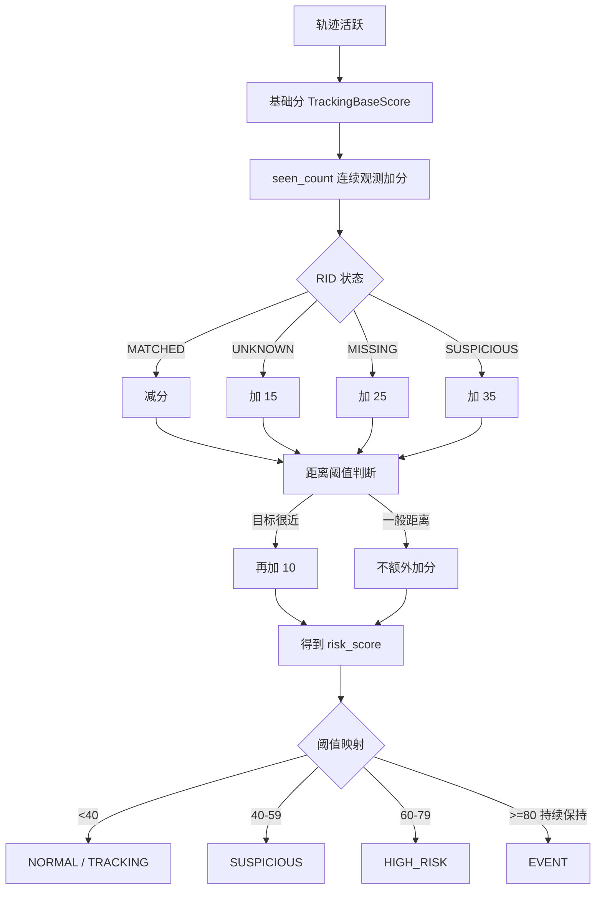
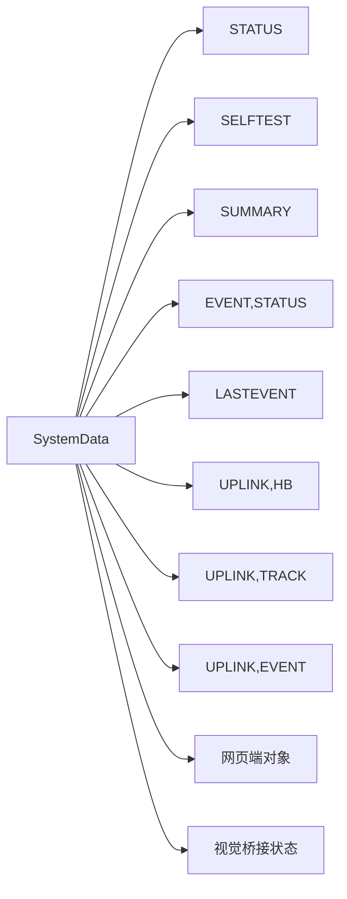
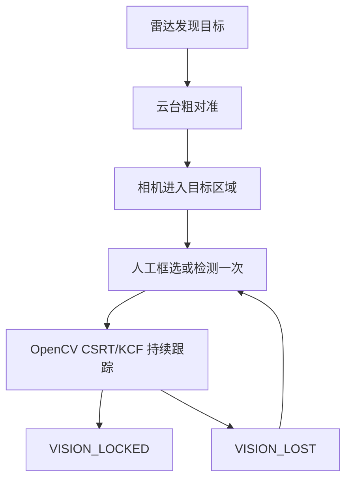

# 2026-04-02 Node A 全功能逻辑图

## 1. 文档目的

这份文档用于把当前项目里已经具备的全部功能、参数意义、状态关系、数据输出关系和后续视觉/网页扩展边界一次性讲清楚。

这份文档重点回答 5 个问题：

1. 当前系统到底由哪些功能模块组成
2. 这些模块之间怎么串起来
3. 关键状态有哪些，它们之间怎么流转
4. 关键参数分别控制什么
5. 串口、上行、视觉、网页端分别吃什么数据

---

## 2. 系统总逻辑图

---

## 3. 功能模块拆解

### 3.1 雷达发现链

作用：

- 接收 `LD2450` 数据
- 输出目标坐标
- 判断目标是否连续出现
- 形成轨迹对象

核心模块：

- `RadarTask`
- `RadarParser`
- `TrackManager`

核心结果：

- `track_id`
- `track_active`
- `confirmed`
- `x`
- `y`
- `vx`
- `vy`

### 3.2 风险研判链

作用：

- 根据轨迹和 RID 状态计算风险分
- 推导当前风险等级
- 决定是否告警、抓拍、守护

核心模块：

- `HunterAction`

核心结果：

- `hunter_state`
- `risk_score`
- `risk_level`
- `trigger_alert`
- `trigger_capture`
- `trigger_guardian`

### 3.3 云台控制链

作用：

- 把雷达坐标转换成云台角度
- 完成扫描、获取、跟踪、丢失几种动作
- 为视觉链提供粗对准入口

核心模块：

- `GimbalPredictor`
- `GimbalController`

核心结果：

- `gimbal_state`
- 粗对准角度输出

### 3.4 事件链

作用：

- 给已确认目标建立事件上下文
- 生成 `event_id`
- 在状态变化时输出事件帧
- 缓存最近事件

核心模块：

- `CloudTask`
- `EventContext`
- `LastEventSnapshot`

核心结果：

- `event_active`
- `event_id`
- `event_level`
- `event_status`
- `last_event_id`

### 3.5 协同接力链

作用：

- 允许人工触发接力请求
- 只有在“confirmed + active + 已有事件上下文”时才正式发接力事件
- 提供接力状态查询

核心命令：

- `HANDOVER,target_node`
- `HANDOVER,STATUS`
- `HANDOVER,CLEAR`

核心结果：

- `handover_pending`
- `handover_last_result`
- `handover_last_target`
- `handover_last_event_id`

### 3.6 视觉增强链

作用：

- 接收主链粗跟踪结果
- 在相机画面内完成近距锁定或目标框跟踪
- 为抓拍做准备

当前实现状态：

- 节点内只完成状态骨架，不做真实视觉推理
- `tools/vision_bridge_视觉桥接.py` 提供最小 `OpenCV` 桥接

核心状态：

- `VISION_IDLE`
- `VISION_SEARCHING`
- `VISION_LOCKED`
- `VISION_LOST`

### 3.7 上云 / 展示链

作用：

- 用统一字段把节点数据输出给后端或网页端
- 区分“事件已创建”和“数据已发出”

核心状态：

- `UPLINK_IDLE`
- `UPLINK_READY`
- `UPLINK_SENDING`
- `UPLINK_OK`
- `UPLINK_FAIL`

---

## 4. 串口命令逻辑图

---

## 5. 状态机总图

### 5.1 主链状态

### 5.2 云台状态

### 5.3 Hunter 状态

### 5.4 视觉状态

### 5.5 上云状态

---

## 6. 参数意义总表

### 6.1 串口与节点基础参数

| 参数 | 位置 | 含义 |
|---|---|---|
| `MonitorBaudRate=115200` | `AppSerialConfig` | USB 串口监视波特率 |
| `RadarBaudRate=256000` | `AppSerialConfig` | 雷达串口波特率 |
| `RadarRxPin=18` | `AppSerialConfig` | 雷达接收引脚 |
| `RadarTxPin=17` | `AppSerialConfig` | 雷达发送引脚 |
| `StartupDelayMs=2000` | `AppSerialConfig` | 上电启动延迟 |
| `NodeId=A1` | `NodeConfig` | 当前节点编号 |
| `NodeRole=EDGE` | `NodeConfig` | 当前节点角色 |
| `NodeZone=ZONE_NORTH` | `NodeConfig` | 当前节点负责区域 |

### 6.2 云台预测与角度参数

| 参数 | 含义 |
|---|---|
| `PredictorKp=0.45` | 云台位置响应比例项 |
| `PredictorKd=0.05` | 云台速度抑制/平滑项 |
| `PredictorFallbackDtSeconds=0.02` | 预测器兜底采样周期 |
| `PredictorLeadTimeSeconds=0.00` | 预测前置时间，当前未提前量 |
| `CenterPanDeg=90` | 水平中心角 |
| `CenterTiltDeg=90` | 俯仰中心角 |
| `MinPanDeg=10` / `MaxPanDeg=170` | 水平角极限 |
| `MinTiltDeg=60` / `MaxTiltDeg=120` | 俯仰角极限 |
| `ScanningAmplitudeDeg=15` | 扫描摆幅 |
| `ScanningPeriodDivisor=900` | 扫描节奏 |
| `MinTiltMapInputMm=0` / `MaxTiltMapInputMm=6000` | 距离到俯仰映射范围 |

### 6.3 舵机输出参数

| 参数 | 含义 |
|---|---|
| `PanPin=4` | 水平舵机引脚 |
| `TiltPin=5` | 俯仰舵机引脚 |
| `PwmFrequencyHz=50` | 舵机 PWM 频率 |
| `PulseMinUs=500` | 舵机最小脉宽 |
| `PulseMaxUs=2500` | 舵机最大脉宽 |

### 6.4 雷达轨迹参数

| 参数 | 含义 |
|---|---|
| `LockDistanceThresholdMm=500` | 判定目标已进入有效锁定距离的阈值 |
| `PollDelayMs=10` | 雷达轮询周期 |
| `ConfirmFrames=5` | 连续多少帧后认为轨迹确认 |
| `LostTimeoutMs=250` | 多久没看到目标就判定丢失 |
| `RebuildGapMs=400` | 轨迹重建的间隔保护 |

### 6.5 风险研判参数

| 参数 | 含义 |
|---|---|
| `TrackingBaseScore=20` | 活跃目标的基础风险分 |
| `SuspiciousThreshold=40` | 进入可疑态阈值 |
| `HighRiskThreshold=60` | 进入高危态阈值 |
| `EventThreshold=80` | 进入事件态阈值 |
| `EventLockHoldMs=500` | 高危保持多久后锁定事件 |

### 6.6 跟踪任务参数

| 参数 | 含义 |
|---|---|
| `AcquireConfirmMs=150` | 获取态确认时长 |
| `LostRecoveryTimeoutMs=3000` | 丢失后恢复窗口 |
| `LoopDelayMs=20` | 跟踪任务循环周期 |

### 6.7 上行参数

| 参数 | 含义 |
|---|---|
| `HeartbeatMs=1000` | 心跳上报周期 |
| `EventReportMs=250` | 活跃轨迹上报周期 |

---

## 7. 风险分数逻辑关系

---

## 8. 数据对象逻辑关系

### 8.1 节点统一数据对象

当前统一数据对象核心字段为：

- `node_id`
- `track_id`
- `track_active`
- `confirmed`
- `x`
- `y`
- `hunter_state`
- `risk_score`
- `risk_level`
- `rid_status`
- `event_active`
- `event_id`
- `trigger_flags`
- `vision_state`
- `vision_locked`
- `capture_ready`
- `uplink_state`
- `timestamp`

### 8.2 字段关系说明

| 字段 | 来源 | 用途 |
|---|---|---|
| `track_id` | `TrackManager` | 区分当前目标轨迹 |
| `track_active` | `TrackManager` | 表示当前是否有活跃目标 |
| `confirmed` | `TrackManager` | 表示是否形成确认轨迹 |
| `x,y,vx,vy` | 雷达/轨迹 | 提供坐标和速度 |
| `hunter_state` | `HunterAction` | 提供风险阶段 |
| `risk_score` | `HunterAction` | 量化风险 |
| `risk_level` | 输出层映射 | 给人和网页更直观的等级 |
| `rid_status` | RID 模拟/后续真实链 | 身份状态 |
| `event_active` | 事件上下文 | 表示当前事件是否存在 |
| `event_id` | `CloudTask` | 关联同一事件 |
| `trigger_flags` | 输出层组合 | 用一个字段表达多个动作条件 |
| `vision_state` | 视觉链 | 表示视觉当前阶段 |
| `vision_locked` | 视觉链 | 表示是否在画面里锁住目标 |
| `capture_ready` | 视觉链 + 风险链 | 表示是否可以抓拍 |
| `uplink_state` | `CloudTask` | 表示上行链本地状态 |
| `timestamp` | 输出层 | 统一时间戳 |

---

## 9. 输出关系图

### 9.1 `STATUS`

适合回答：

- 当前正在发生什么
- 当前主链、视觉链、上云链分别处于什么状态

### 9.2 `SELFTEST`

适合回答：

- 当前运行参数和模式是否正确
- 舵机、调试、上行、视觉状态是否处于预期值

### 9.3 `SUMMARY`

适合回答：

- 这次测试一共发生了几次状态变化和事件变化

### 9.4 `LASTEVENT`

适合回答：

- 最近一次事件是什么

### 9.5 `EVENT,STATUS`

适合回答：

- 当前有没有事件
- 最近一次事件快照是什么

### 9.6 `UPLINK,*`

适合回答：

- 后端或网页应该吃什么数据

---

## 10. 视觉链实现建议

### 10.1 当前最稳实现链

### 10.2 为什么先不用纯视觉远距发现

因为当前阶段目标是：

- 先把链路闭环
- 先把近距锁定做稳
- 先把抓拍入口做通

而不是一上来做最难的远距视觉发现。

### 10.3 OpenCV 推荐实现思路

第一阶段：

- 手动框选目标
- `CSRT` 或 `KCF` 跟踪
- 输出 `VISION_*` 状态

第二阶段：

- `YOLOv8n` 检测一次
- 跟踪器维持目标框
- 丢失后重新检测

第三阶段：

- 高风险/事件态触发抓拍
- 图片文件和 `event_id` 关联

---

## 11. 网页端推荐实现思路

### 11.1 最稳路线

- 前端：`HTML + CSS + JavaScript`
- 图表：`ECharts`
- 后端：`Flask` 或 `FastAPI`
- 通信：`MQTT`
- 实时：`WebSocket` 或轮询
- 存储：`SQLite`

### 11.2 页面第一版只做这些

- 节点在线状态
- 当前目标坐标
- 当前风险等级
- 当前事件状态
- 最近事件列表
- 抓拍入口

### 11.3 先不要做这些

- 权限系统
- 后台管理
- 空壳大屏
- 没有实时数据支撑的炫酷动画

---

## 12. 当前逻辑图结论

当前项目已经不再只是“一个雷达带一个云台”，而是由三条链组成：

1. 主链：发现、确认、研判、事件、上行
2. 视觉链：粗对准后近距锁定与抓拍
3. 展示链：标准化对象驱动网页显示

所以后续推进时，最重要的不是盲目加功能，而是始终确保：

- 状态定义统一
- 参数意义清楚
- 字段输出稳定
- 各模块边界不混

